# CleanArc - Animal Adoption & Shelter Marketplace

An animal adoption platform where users list animals for adoption, send adoption requests, and shelters sell pet products with integrated payments and shipment tracking.

I built an [MVC version](https://github.com/Ahmedhossam447/Pet-Adoption) of this platform first, then wanted an API-focused backend — Clean Architecture, CQRS, and best practices for maintainable, testable code.

---


## Architecture

```
CleanArc.Core          → Domain entities, interfaces, primitives, event publisher interface (no dependencies)
CleanArc.Application   → Commands, queries, handlers, validators (depends on Core only)
CleanArc.Infrastructure → Database, S3, Paymob webhook security, RabbitMQ, MassTransit consumers (depends on Core only)
CleanArc.API           → Controllers, middleware, DI composition (depends on Application + Infrastructure)
CleanArc.Testing       → Unit + architecture tests
```



```mermaid
graph TB
    %% ======================== CLIENT ========================
    Client["🖥️ Client"]

    %% ======================== API LAYER ========================
    subgraph API["CleanArc.API"]
        direction TB
        Controllers["Controllers<br/>(Auth · Animals · Orders · Products<br/>Payments · Requests · Chat · Users)"]
        GlobalEx["GlobalExceptionHandler<br/>(ProblemDetails RFC 7807)"]
        Swagger["Swagger + JWT Auth"]
        Middleware["JWT Middleware<br/>+ Role Authorization"]
    end

    %% ======================== APPLICATION LAYER ========================
    subgraph Application["CleanArc.Application"]
        direction TB
        MediatR["MediatR Pipeline"]

        subgraph Pipeline["Pipeline Behaviors"]
            Validation["FluentValidation<br/>Behavior"]
            Caching["ICacheableQuery<br/>Behavior"]
        end

        subgraph CQRS["CQRS"]
            Commands["Commands<br/>(Create · Update · Delete<br/>Adopt · Checkout · Accept)"]
            Queries["Queries<br/>(Get · List · Search<br/>Available · Dashboard)"]
        end

        subgraph Handlers["Command & Query Handlers"]
            AuthH["Auth Handlers<br/>Login · GoogleLogin · Register"]
            AnimalH["Animal Handlers<br/>Create · Update · Delete · Adopt"]
            OrderH["Order Handlers<br/>Create · AddItem · RemoveItem<br/>Checkout · UpdateItemStatus"]
            ProductH["Product Handlers<br/>Create · Delete"]
            RequestH["Request Handlers<br/>Create · Accept · Reject<br/>Update · Delete"]
            PaymentH["Payment Handler<br/>ProcessPaymobWebhook"]
        end

        EventPublisher["IEventPublisher<br/>(Core Abstraction)"]
    end

    %% ======================== CORE LAYER ========================
    subgraph Core["CleanArc.Core"]
        direction TB
        Entities["Entities<br/>(Animal · Order · Product<br/>Request · RefreshToken<br/>MedicalRecord · Vaccination)"]
        Interfaces["Interfaces<br/>(IUnitOfWork · IRepository · IAuthService<br/>ITokenService · IPaymentService<br/>IImageService · IUserService<br/>IGoogleAuthService · INotificationService)"]
        Primitives["Primitives<br/>(Result‹T› · Error · UserErrors)"]
        DomainEvents["Domain Events<br/>(AnimalAdoptedEvent)"]
    end

    %% ======================== INFRASTRUCTURE LAYER ========================
    subgraph Infrastructure["CleanArc.Infrastructure"]
        direction TB

        subgraph DataAccess["Data Access"]
            DbContext["AppDbContext<br/>(EF Core)"]
            UoW["UnitOfWork<br/>Begin · Commit · Rollback<br/>ExecuteSqlRaw"]
            GenericRepo["Repository‹T›<br/>+ Eager Loading"]
            AnimalRepo["AnimalRepository<br/>(GetAvailableForAdoption)"]
        end

        subgraph Services["Infrastructure Services"]
            AuthSvc["AuthService<br/>(Identity + JWT)"]
            TokenSvc["TokenService<br/>(Access + Refresh)"]
            GoogleSvc["GoogleAuthService<br/>(OAuth 2.0 JWT Validation)"]
            ImageSvc["ImageService<br/>(S3 Upload · Compress)"]
            PaymentSvc["PaymentService<br/>(Paymob API)"]
            PaymobSec["PaymobSecurity<br/>(HMAC-SHA512)"]
            NotifSvc["NotificationService<br/>(SignalR)"]
        end

        subgraph Realtime["Real-time"]
            ChatHub["ChatHub<br/>(SignalR)"]
            NotifHub["NotificationHub<br/>(SignalR)"]
        end

        subgraph BackgroundJobs["Background Jobs"]
            HangfireServer["Hangfire Server"]
        end

        subgraph Messaging["Domain Event Bus"]
            MassTransitBus["MassTransit Bus"]
            Consumers["Consumers<br/>📧 EmailConsumer<br/>📋 AuditLogConsumer"]
        end
    end

    %% ======================== EXTERNAL SERVICES ========================
    subgraph External["External Services"]
        direction TB
        SQLServer[("🗄️ SQL Server")]
        Redis[("⚡ Redis<br/>Cache + Hangfire")]
        RabbitMQ[("🐇 RabbitMQ")]
        S3["☁️ AWS S3"]
        Paymob["💳 Paymob"]
        Google["🔐 Google OAuth"]
    end

    %% ======================== TESTING ========================
    subgraph Testing["CleanArc.Testing"]
        UnitTests["94 Unit Tests<br/>(xUnit · NSubstitute · FluentAssertions)"]
        ArchTests["Architecture Tests<br/>(NetArchTest)"]
    end

    %% ======================== CONNECTIONS ========================

    %% Client → API
    Client -->|"HTTP/HTTPS<br/>REST API"| Controllers
    Client <-->|"WebSocket"| ChatHub
    Client <-->|"WebSocket"| NotifHub

    %% API internal
    Controllers --> Middleware
    Controllers --> GlobalEx

    %% API → Application (MediatR)
    Controllers -->|"IMediator.Send()"| MediatR
    MediatR --> Validation
    Validation --> Caching
    Caching --> CQRS
    Commands --> Handlers
    Queries --> Handlers

    %% Handlers → Core (Domain Logic)
    Handlers -.->|"uses"| Entities
    Handlers -.->|"uses"| Interfaces
    Handlers -.->|"uses"| Primitives

    %% Handlers → Event Publisher
    AnimalH -->|"Publish<br/>AnimalAdoptedEvent"| EventPublisher
    EventPublisher -.->|"abstraction"| DomainEvents

    %% Application → Infrastructure (via Core interfaces)
    Interfaces -.->|"implemented by"| DataAccess
    Interfaces -.->|"implemented by"| Services

    %% Infrastructure → External
    DbContext -->|"EF Core"| SQLServer
    UoW -->|"Transactions"| SQLServer
    Caching -->|"Cache-Aside<br/>Read/Invalidate"| Redis
    HangfireServer -->|"Job Storage"| Redis
    ImageSvc -->|"Upload/Delete"| S3
    PaymentSvc -->|"Auth Token<br/>Create Order<br/>Payment Key"| Paymob
    PaymobSec -->|"HMAC Validation"| Paymob
    GoogleSvc -->|"JWT Validation"| Google
    MassTransitBus -->|"Publish"| RabbitMQ
    RabbitMQ -->|"Consume"| Consumers

    %% Background Jobs
    AnimalH -->|"Enqueue<br/>Photo Deletion"| HangfireServer
    HangfireServer -->|"Execute"| ImageSvc

    %% Notifications
    RequestH -->|"Notify"| NotifSvc
    NotifSvc --> NotifHub

    %% Testing
    Testing -.->|"tests"| Application

    %% ======================== STYLES ========================
    classDef apiStyle fill:#4A90D9,stroke:#2C5F8A,color:#fff
    classDef appStyle fill:#7B68EE,stroke:#5B4ACE,color:#fff
    classDef coreStyle fill:#E8A838,stroke:#C08420,color:#fff
    classDef infraStyle fill:#50C878,stroke:#3A9A5C,color:#fff
    classDef externalStyle fill:#FF6B6B,stroke:#CC5555,color:#fff
    classDef testStyle fill:#A0A0A0,stroke:#707070,color:#fff
    classDef clientStyle fill:#333,stroke:#111,color:#fff

    class Client clientStyle
    class API apiStyle
    class Application appStyle
    class Core coreStyle
    class Infrastructure infraStyle
    class External externalStyle
    class Testing testStyle
```

### Patterns & Practices

- **Clean Architecture** – Core has no infrastructure dependencies; business logic stays isolated
- **CQRS** – Commands and queries separated via MediatR
- **Result pattern** – `Result<T>` for expected failures instead of exceptions
- **Unit of Work** – Shared DbContext, transaction management for atomic operations
- **Repository** – Generic `Repository<T>` with eager loading, specialized `AnimalRepository` for domain-specific queries
- **Domain events** – `IEventPublisher` abstraction in Core, MassTransit implementation in Infrastructure, RabbitMQ consumers for adoption emails and audit logging
- **FluentValidation** – Request validation in the pipeline
- **Role-based auth** – JWT with User, Shelter, Admin roles

---

## Tech Stack

- .NET 10, Entity Framework Core, SQL Server
- ASP.NET Core Identity, JWT
- MediatR, FluentValidation
- SignalR (chat, notifications)
- Hangfire (background jobs), Redis (cache, Hangfire storage)
- MassTransit + RabbitMQ (domain events)
- AWS S3, Paymob

---

## Features

### Core Features

- **Animal Management** – Create, read, update, delete animals with photos
- **Medical Records** – One-to-one with animals
- **Vaccination Tracking** – One-to-many with medical records
- **Adoption Requests** – User-to-user requests; accepting one auto-rejects other pending requests
- **Product Catalog** – Shelters add/edit/delete products with photos and stock
- **Order System** – Cart, add/remove items, checkout; order saved as Pending before payment
- **Payment Integration** – Paymob webhook; stock decremented only on confirmed payment
- **Shipment Tracking** – Per-item status (Pending → Processing → Shipped → Delivered)
- **Shelter Sales Dashboard** – Shelters view paid orders containing their products
- **User Authentication** – JWT with refresh tokens, role assignment (User/Shelter)
- **Social Login** – OAuth 2.0 Authentication with automatic account linking for existing users
- **Real-time Chat** – SignalR for user-to-user and user-to-shelter messaging
- **Real-time Notifications** – SignalR notifications for single or multiple users
- **Photo Management** – AWS S3 with compression; Hangfire for async deletion
- **Background Jobs** – Hangfire for photo deletion and adoption request processing
- **Caching** – Redis distributed cache with invalidation on writes
- **Domain Events** – MassTransit + RabbitMQ (adoption emails, audit logging)
- **Transaction Management** – Unit of Work for atomic operations

### Role-Based Access Control

| Role | Capabilities |
|------|--------------|
| **User** | Create animals, send/accept/reject adoption requests, adopt, create orders, manage cart, checkout, chat |
| **Shelter** | Create animals, manage products (CRUD), view sales dashboard, update shipment status, chat |
| **Admin** | Update adoption requests |

### Security

- Role-based authorization on endpoints
- Ownership checks in handlers (users modify only their own resources)
- JWT with role claims
- HMAC-SHA512 webhook validation (timing-safe)
- FluentValidation on commands/queries
- Global exception handling middleware
- RowVersion on Product for optimistic concurrency

### Concurrency & Data Integrity

- **Atomic SQL** – Stock decrement via raw SQL to prevent race conditions
- **Lock ordering** – Items sorted by ProductId before processing to prevent deadlocks
- **Transaction wrapping** – Multi-product stock decrements are all-or-nothing
- **Duplicate cart merging** – Same ProductId entries merged before processing

---

## Flows

### Order & Payment Flow

```
User → POST /api/order [{productId, qty}, ...]
  → Validate stock (soft check)
  → Merge duplicate product IDs
  → Save Order + OrderItems to DB (Status: "Pending")
  → Return CreateOrderResponse with OrderId

User → POST /api/order/{id}/items   (add items)
User → DELETE /api/order/{id}/items/{itemId}  (remove items)

User → POST /api/order/{id}/checkout
  → Re-validate stock, recalculate subtotal
  → Create PaymentTransaction (Pending)
  → Call Paymob API → get payment URL
  → Return CheckoutOrderResponse with PaymentUrl

User → Pays on Paymob iframe

Paymob → POST /api/payment/webhook?hmac=xxx
  → Validate HMAC (timing-safe)
  → Success? → Atomic SQL stock decrement (sorted by ProductId, in transaction)
              → Order status "PaymentReceived"
  → Failed?  → Order status "PaymentFailed" (stock untouched)

Shelter → GET /api/order/my-sales  (view paid orders)
Shelter → PATCH /api/order/{id}/items/{itemId}/status  (update shipment)
  → Status: Pending → Processing → Shipped → Delivered
```

### Adoption Flow

```
User-listed animals:
  User A creates animal → User B sends adoption request
  → User A accepts/rejects → Accepted: animal marked adopted, other requests auto-rejected

Shelter-listed animals:
  Shelter creates animal → User contacts shelter via chat
  → Adoption handled directly (no request system)

Domain event:
  On adoption → AnimalAdoptedEvent published
  → Consumers: send email, write audit log (MassTransit + RabbitMQ)
```

### OAuth 2.0 Authentication Flow

```
Client → OAuth 2.0 Provider (e.g., Google)
  → User logs in & grants consent
  → Provider issues OpenID Connect JWT (id_token)

Client → POST /api/auth/google-login { "tokenId": "..." }
  → Validate Provider JWT signature & audience
  → IF User exists (by email):
      → Ensure EmailConfirmed = true
      → Add UserLogin mapping (links Provider ID to existing account)
  → IF User is new:
      → Generate unique username (email prefix + random) and secure password
      → Register User in Db with Role "User" and EmailConfirmed = true
      → Add UserLogin mapping
  → Generate system JWT Access Token & Refresh Token
  → Return Tokens to Client
```

### Stock Concurrency Strategy

- **Atomic SQL** – `UPDATE Products SET StockQuantity = StockQuantity - @qty WHERE Id = @id AND StockQuantity >= @qty`
- **Lock ordering** – Order items sorted by ProductId before decrement
- **Transaction wrapping** – All decrements in one transaction (all-or-nothing)
- **RowVersion** – On Product entity for optimistic concurrency
- **DB-first** – Order saved before Paymob call to avoid orphaned payment orders

### Photo Management

- **Upload** – Images compressed and resized before S3 upload
- **Update** – Old photo deleted via Hangfire, new photo uploaded
- **Delete** – Photo deletion queued via Hangfire background job
- **Compression** – Configurable max dimensions and quality

### Background Jobs (Hangfire)

- Photo deletion queued asynchronously
- Adoption request processing (reject other pending requests)
- Dashboard at `/jobs`

### Caching (Redis) – Cache-Aside

- **Cache-Aside** (lazy loading): read from cache first; on miss, load from DB and populate cache
- Writes go to DB; handlers invalidate cache (`RemoveAsync`) on create/update/delete
- `ICacheableQuery` pipeline behavior for cacheable queries

### Unit of Work & Repository

- **Unit of Work** – `BeginTransactionAsync`, `CommitTransactionAsync`, `RollbackTransactionAsync`, `ExecuteSqlRawAsync`
- **Repository** – Generic `Repository<T>()` and specialized `AnimalRepository`
- **Eager loading** – `GetAsync` with `Include` expressions
- All repositories share the same DbContext for transaction consistency

### SignalR & Notifications

- **ChatHub** – Real-time messaging
- **NotificationService** – `SendNotificationToUserAsync`, `SendNotificationAsync` (broadcast)
- **IUserIdProvider** – User ID from JWT claims

---

## Project Structure

```
CleanArc/
├── CleanArc.API/           # API (controllers, middleware)
├── CleanArc.Core/       # Domain (entities, interfaces, primitives)
├── CleanArc.Application/  # Commands, queries, handlers, validators
├── CleanArc.Infrastructure/ # DbContext, repositories, UnitOfWork, services, hubs
└── CleanArc.Testing/    # Unit tests
```

---

## Setup

**Prerequisites:** .NET 10 SDK, SQL Server, Redis, RabbitMQ, AWS (S3), Paymob

1. Configure `appsettings.json` (connection strings, JWT, AWS, Paymob, email).
2. `dotnet ef database update --project CleanArc.Infrastructure --startup-project "CleanArc.API"`
3. Start Redis and RabbitMQ.
4. `dotnet run --project "CleanArc.API"`

Swagger at `/swagger`, Hangfire at `/jobs`. Roles seeded on startup.

---

## API Overview

- **Auth** – Register, login, google-login, refresh, logout, confirm email, forgot/reset password
- **Animals** – CRUD, search, available for adoption, adopt
- **Products** – CRUD (Shelter)
- **Orders** – Create, add/remove items, checkout, sales (Shelter), shipment status
- **Payments** – Webhook (Paymob)
- **Requests** – Create, accept, reject, list (User)
- **Chat** – History, unread, mark read
- **Users** – Profile, update

---

## Testing

94 unit tests in `CleanArc.Testing` covering all command handlers across the application:

| Domain | Handlers Tested |
|--------|----------------|
| **Auth** | Login, GoogleLogin, Register |
| **Orders** | CreateOrder, AddOrderItem, RemoveOrderItem, UpdateOrderItemStatus, CheckoutOrder |
| **Animals** | AdoptAnimal, CreateAnimal, DeleteAnimal, UpdateAnimal |
| **Products** | CreateProduct, DeleteProduct |
| **Payments** | ProcessPaymobWebhook |
| **Requests** | CreateRequest, AcceptRequest, RejectRequest, DeleteRequest, UpdateRequest |

Architecture tests via NetArchTest. NSubstitute for mocking, FluentAssertions for readable assertions.

```bash
dotnet test "Clean Arc.sln"
```
